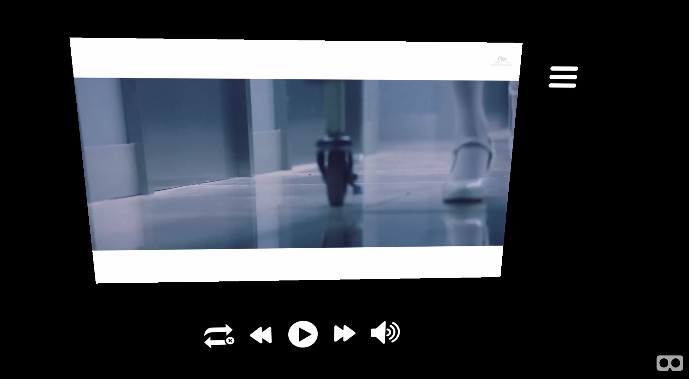

# project4

VR Theater
-------------
A VR viewing experience that allows someone to watch videos in VR without breaking their immersion.

* Control the video without touching the screen or pressing a button
* Play a video from a playlist that you can toggle
* Toggle between repeating one video or all videos
* Hide list of videos with a collapsible menu

###General Approach
 * First read through the A-Frame documentation online
 * Created a simple page that displayed boxes and rectangles
 * Remade the page with images and experimented with changing the images based on the viewer's viewing cursor
 * Replaced the images with videos and messed around with JavaScript to see to what extent they could be controlled
 * Forms, divs, and text would render behind the canvas and not interact with the cursor so they were avoided when creating this project
 * Once videos displayed properly in the app, I came up with a list of things I would want when watching videos and attempted to incorporate them into the app while being as simple as possible

###Installation Instructions
* Fork and clone repo
* npm install && npm start

###User Stories
* People who wish to watch videos in VR or their own personal theater
* Watch videos without breaking immersion by having to leave the VR view to click or select the next video every single time

###Unsolved Problems/Future Goals
* Currently unable to pull videos from outside sources
* Everything is currently front-end, which has its pros and cons
* Attempted to port the app over to Ionic, but there were issues with how the videos were rendered and how iOS interacted with WebGL
* Uploading files onto Amazon S3 and pushing the app as a simple Node app was met with many errors and difficulties which are still being worked on

###Technologies Used
 * WebVR, A-Frame, Three.js, WebGL, HTML, CSS

Other Versions/Repos
---------
* **github.com/eun-n/pro4mean** - MEAN Stack application that compiles the top 50 songs from Melon's Chart (Korean Music Site) and displays the title, artist, album, and an embedded music video through iframe
* **github.com/eun-n/pro4** - Web scraping app created to pull the list of Korea's top 50 songs and put their information into a JSON file
* **github.com/eun-n/project4** - VR app as a simple Node application with videos and images stored in buckets using Amazon S3
